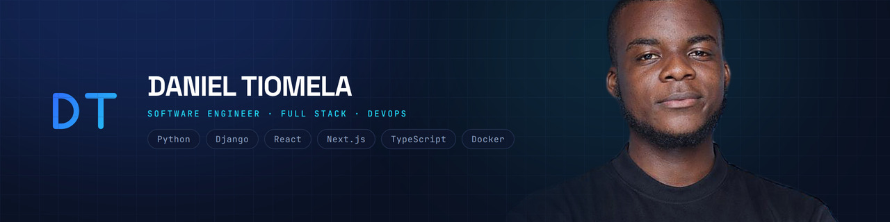
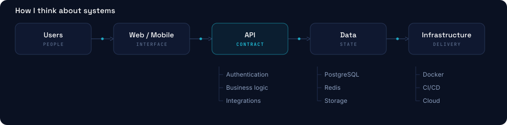
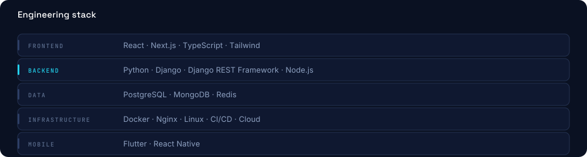

<!--
  Daniel Tiomela Jou  GitHub profile README
  Repo: danieljou/danieljou   ·   Assets: commit the assets/ folder alongside this file.

  Fill in before publishing:
    · PORTFOLIO_URL      (2 places  the hero badge and the closing CTA)
    · the Portfolio Website repository link
    · one measurable outcome per project (see the TODO notes)
-->

# Daniel Tiomela Jou

**Software Engineer**  Full Stack · Python · React · DevOps

I build modern web applications, scalable APIs and reliable software infrastructure 
from the data model through to the deployment pipeline.

`Python` · `Django` · `React` · `Next.js` · `Docker` · `PostgreSQL`

<!-- Add once the portfolio is live:
 -->

Yaoundé, Cameroon (UTC+1) · Open to remote work worldwide

---

## About

I'm a Software Engineer who works across the stack  frontend interfaces, backend
architecture, and the infrastructure that puts both into production.

What I care about is the part that comes after the merge. A feature is not finished
when it works on my machine; it is finished when someone else can read the code,
deploy it, and keep it running. That is why I reach for clear architecture over
clever solutions, and why I would rather own a feature through production than hand
it over at review.

I work comfortably in a written-first, distributed setting: decisions get documented,
risks get flagged early, and estimates get corrected the day they turn out to be wrong.

---

## Engineering Principles

**Build with purpose**  Solve the real problem before adding complexity.

**Keep it maintainable**  Clear architecture and readable code outlive clever code.

**Automate what matters**  Repetitive work belongs in tooling, not in someone's day.

**Design for reliability**  Systems should be observable, testable, and boring in production.

**Ship and iterate**  Software gets good through feedback, not through planning.

---

## What I Build

| | |
|---|---|
| **Web Applications** | Modern interfaces and production-ready web applications. |
| **APIs & Backend Systems** | REST APIs, authentication, business logic and data services. |
| **Software Architecture** | Modular systems, integrations and maintainable application structure. |
| **DevOps & Infrastructure** | Containerised deployments, CI/CD, reverse proxies and cloud environments. |
| **Mobile Applications** | Cross-platform applications when the product needs to be in a pocket. |

---

## How I Think About Systems

A generic shape, not a specific project  the layers I reason in before writing code.
Each one names what it *does*, not which framework does it, because the framework is
the part most likely to change.

---

## Core Expertise

Not everything I have touched  what I actually reach for.

**Infrastructure**  Linux · Nginx · CI/CD · Containers · Cloud · Deployment

**Also work with**  Flutter · React Native · Node.js · MongoDB · Redis · GraphQL · Firebase

---

## Selected Projects

### Minhdu API

> Backend service built on a Django and PostgreSQL core, containerised for deployment.

**Built with** Django · Django REST Framework · PostgreSQL · Docker
**Focus** API architecture · data modelling · containerised deployment
**Status** Live

<!-- TODO  one line here is worth more than every badge above it. What does it do
     for whom, and what changed because it exists? A number if you have one. -->

[Repository →](https://github.com/danieljou/Minhdu)

 

### EasyFood

> Cross-platform mobile application backed by Firebase.

**Built with** Flutter · Dart · Firebase
**Focus** Mobile interface · realtime data · authentication
**Status** In development

<!-- TODO  who is it for, and what problem does it remove for them? -->

[Repository →](https://github.com/danieljou/EasyFood)

 

### Portfolio Website

> Personal portfolio and engineering case studies.

**Built with** Next.js · Tailwind CSS · Framer Motion
**Focus** Frontend architecture · motion · performance
**Status** In progress

<!-- TODO  this link currently points at the profile, not the repository.
     Replace with the real URL, e.g. https://github.com/danieljou/portfolio -->

[Repository →](https://github.com/danieljou)

---

## Engineering Stack

---

## Certifications

| Certification | Provider | Date |
|---|---|---|
| Scrum Fundamentals Certified (SFC™) | ScrumStudy | Sept 2025 |
| Software Architecture & Code Design in OOP | Udemy | Jun 2025 |
| Node.js  Modern RESTful API Fundamentals | Udemy | Apr 2025 |
| Master Django Web Development | Alison | Feb 2025 |
| Intro to JavaScript for React Developers | CodeSignal | Feb 2025 |

[View all certifications on LinkedIn →](https://www.linkedin.com/in/daniel-tiomela-jou-40250b279/details/certifications/)

---

## GitHub Activity

---

## Currently Exploring

- Software architecture and system design
- Cloud infrastructure and deployment automation
- Scalable backend systems
- Flutter internals

---

## Let's Build Something

I'm interested in engineering problems worth solving, products that need building
properly, and teams where an engineer is trusted to own a feature end to end.

The fastest way to reach me is email  I answer within a day.

---

**Daniel Tiomela**  Software Engineer
*Building software. Engineering solutions.*
